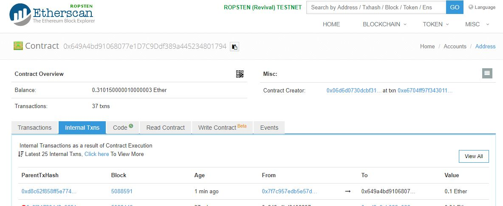
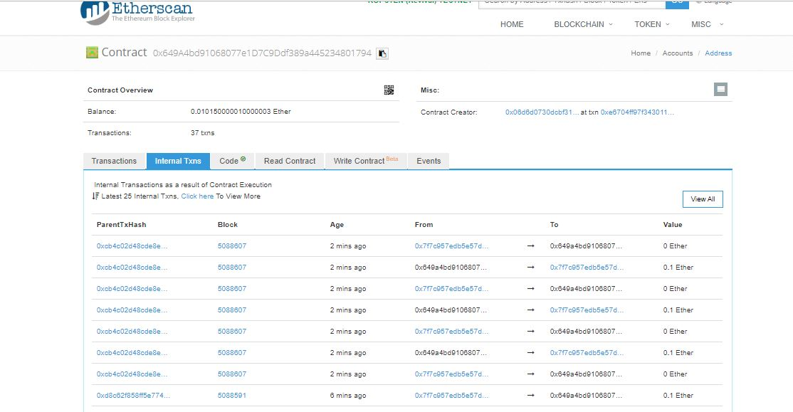

## Project 2

### Question 1

Rock paper Scissors game play

### Question 2      

Contract is at [0x7f7c957edb5e57d6fde45229608ce1052e615c2b](https://ropsten.etherscan.io/address/0x7f7c957edb5e57d6fde45229608ce1052e615c2b)      

 Deposit 0.1 ether from attack contract into the vulnearbale contract          
     

 Stole from the vulnerable contract and emptied out the contract, stealing is limited to 5x the initial deposit:  
     